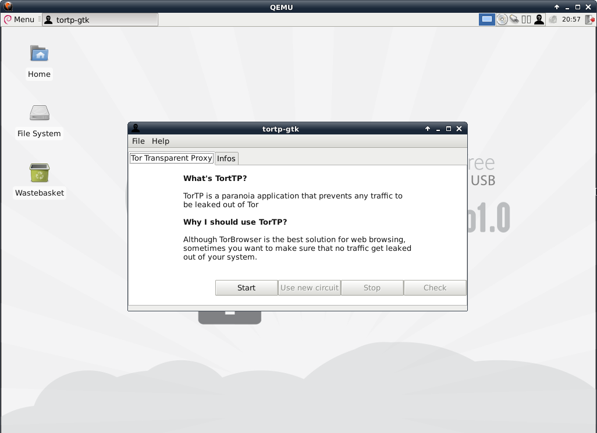

TorTP
==========

TorTP changes the local iptables configuration in order to force all TCP traffic through Tor (and also UDP DNS requests).
Other network traffic which is not capable of passing through Tor (such as UDP or ICMP) it is just dropped.

TorTP is based on [stem](https://stem.torproject.org/), a python library which makes easier to enable embedded Transparen Proxy and DNS server capabilities in Tor.

HowTo install:
=============

Add freepto repository:

<code>$ wget http://deb.freepto.mx/deb.gpg</code>

<code>$ cat deb.gpg | apt-key add -</code>

<code>$ echo "deb http://deb.freepto.mx/freeptorepo berenjena main" > /etc/apt/sources.list.d/freepto.list</code>

Install:

<code>sudo apt-get install tortp python-tortp</code>

Enable Tor Control Port:

<code>sed -i 's/#ControlPort 9051/ControlPort 9051/' /etc/tor/torrc</code>

Install GUI (optional):

<code>apt-get install tortp-gtk</code>

HowTo use TorTP:
=================

# cli

<code>$ sudo tortp -h</code>

<code>$ man tortp</code>

# gui

